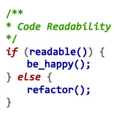

## Coding Standards: The Foundation of High-Quality Code

Coding standards are often perceived as trivial rules such as the placement of curly braces or indentations in computer programming. However, they play a much more crucial role in software development, since they can significantly impact the quality, maintainability and readability of your code. These standards are the rules and conventions that developers follow and adhere to when writing and organizing their code in order to maintain consistent, bug-free, and efficient code, especially when programmers are working in big team environments.

## ESLint: Automating Best Practices

To enforce these coding standards, tools like ESLint help to automate the process. ESLint is a static code analysis tool used in Typescript and JavaScript to help developers automatically detect and fix errors within their code. This ensures that the code adheres to the coding standards. For example, Airbnb's ESLint configuration for VS Code provides a set of rules that prioritizes the best practices and coherent coding style, particularly while programming in TypeScript. 

## My Experience with ESLint and VSCode

After my first week of using ESLint with VSCode, I found the experience both challenging and rewarding. Initially, I had problems properly setting up ESLint in VSCode since it was a painful and time-consuming task. For example, errors would consistently pop up indicating how I was missing certain things before I could get it up and running. Also, after I would fix an error within my code and try to save it, it would revert the error back into its original state. However, once it finally did start to work, it became a godsend. ESLint helped me to identify and fix potential issues early, which ensured that my code was consistent and had no errors. This allowed me to pay more attention to how my code was working behind the scenes. In addition, it helped to speed up fixing simpler issues like checking the number of spaces within the line.

## Conclusion

Overall, I feel that coding standards are essential in software development and should not be overlooked. They help provide a framework for developers to write clean, consistent and maintainable code. Coding standards are also crucial guidelines for both the individual developers and teams. My experience with ESLint in VSCode has reinforced the importance of adhering to coding standards, since it has significantly improved my coding practices and overall code quality. Embracing coding standards is a valuable step towards becoming a proficient and responsible software developer.
