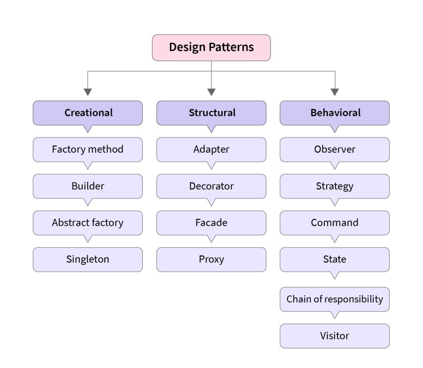

Imagine you’re hosting a dinner party. You want to create a memorable meal that impresses your guests or triggers a nostalgic childhood experience. Instead of inventing recipes from scratch, you reach for a trusted cookbook filled with tried-and-true dishes. Design patterns in software development are like those recipes, proven solutions crafted over time by experts to address recurring problems in software architecture.

## What Are Design Patterns?

The concept of design patterns was first introduced by architect <a href="https://www.designsystems.com/christopher-alexander-the-father-of-pattern-language/">Christopher Alexander</a> in 1977. He described in his book, <a href="https://arl.human.cornell.edu/linked%20docs/Alexander_A_Pattern_Language.pdf">"A Pattern Language"</a>, patterns as solutions to problems that occur repeatedly, so that the solution could be used “a million times over, without ever doing it the same way twice.” In software, design patterns emerged in the 1990s, championed by the <a href="https://refactoring.guru/design-patterns/history">"Gang of Four"</a> (Erich Gamma, John Vlissides, Ralph Johnson, and Richard Helm) in their seminal book, <a href="http://www.uml.org.cn/c++/pdf/DesignPatterns.pdf"><i>Design Patterns: Elements of Reusable Object-Oriented Software</i></a>. This book incorporates years of trial and error into 23 reusable solutions for common software problems.

At their core, design patterns are templates for solving common challenges in software design. They help bridge the gap between beginner developers and seasoned veterans by including complex problems into reusable solutions. Just as a novice chef benefits from the expertise of a seasoned executive chef when he bakes from a recipe, new developers gain confidence and efficiency by applying patterns that have stood the test of time.

## Learning From the Roofs Above Us

Even though HTML and CSS are fundamental tools, relying solely on them can become problematic especially when a designer creates his webpages to be consistent across various browsers. As websites grow larger and more interactive, managing raw HTML and CSS becomes increasingly difficult and complex.  Having to manually implement every new custom layout or style not only takes more time but also introduces the unpredictable risk of errors and requires constant maintenance. On the other hand, using a framework like Bootstrap 5 simplifies this process by providing pre-built components and responsive features that are compatible with various browsers and platforms, allowing developers to create consistent layouts across devices more efficiently.  
 

## Patterns in My Code Kitchen

My first introduction to Bootstrap 5 felt overwhelming, since there were so many new classes, components and rules to learn. This was especially true when it came to working on the first few assignments where I had to recreate various websites with tasks ranging from implementing a responsive navigation bar to creating a grid-based layout for a footer. I struggled to understand how to match the exact placement of those elements based on the original websites. However, despite the learning curve, extensive time invested and the frustration I experienced, I gained more practical experience by using the framework.  Ultimately, I slowly became more familiar and proficient with its features, and remarkably began to see the benefits of how it simplified the development process. For example, when I was first given the task to recreate the Island Snow Website, I initially had issues with getting the exact placement of the elements within the navigation bar because I was unfamiliar with the framework. However, after continuously experimenting with Bootstrap 5’s various pre-built components, I soon discovered how flexible using it was since it didn’t restrict the use of my own CSS styling for the framework, which ultimately allowed me to recreate the website needed.  

## The Balancing Act

Overall, UI frameworks offer significant advantages for web developers, such as Bootstrap 5. They help speed up the development process, maintain consistency across projects and ensure that websites are responsive and easy to maintain. Despite there being a massive learning curve, the time invested in mastering a UI framework like Bootstrap 5 pays off, allowing developers to work more efficiently and produce high-quality web pages with less effort.

## Conclusion

